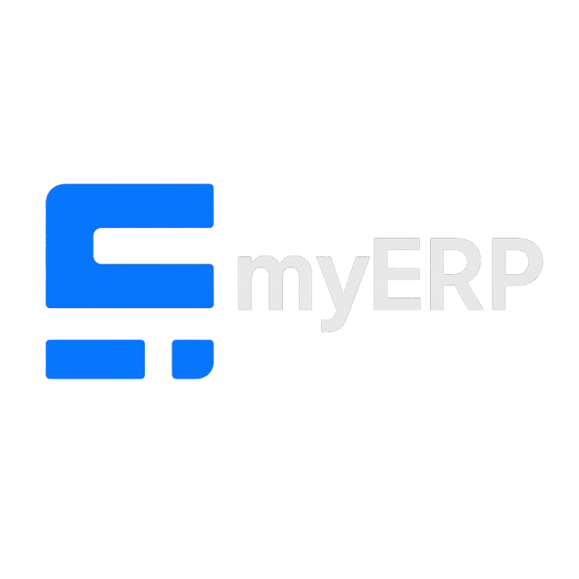

<p align="center">
  
</p>

# 📊 myERP

Sistema de gestão de cotações desenvolvido em **Python** com **Streamlit** e **SQLite (via SQLAlchemy)**, permitindo:
- Criar e gerir pedidos de cotação (RFQs)
- Responder cotações e enviar orçamentos
- Gerar PDFs automáticos (pedido e cliente)
- Configurar fornecedores, marcas e margens
- Enviar orçamentos por e-mail diretamente pelo sistema

---

## 📂 Estrutura do Projeto

.
├── main.py # Interface principal Streamlit e lógica de negócio
├── db.py # Camada de acesso à BD via SQLAlchemy (SQLite local)
├── requirements.txt # Dependências do projeto
├── README.md # Este ficheiro

---

## 🚀 Funcionalidades

- **Dashboard**
  - Estatísticas gerais
  - Últimas cotações
- **Nova Cotação**
  - Criar RFQs com múltiplos artigos
  - Associar fornecedor e marca
  - Gerar PDF de pedido
- **Smart Quotation**
  - Upload de PDF com preenchimento automático da cotação
- **Process Center**
  - Inserir preços, prazos e dados logísticos
  - Cálculo automático de preços de venda baseado na margem
  - Geração e envio automático de PDF para o cliente
- **Relatórios**
  - Estatísticas gerais e por fornecedor
- **Gestão de PDFs**
  - Todos os utilizadores podem visualizar
  - Apenas administradores podem substituir os ficheiros
- **Layout de PDF personalizável**
  - Ajuste textos, fontes e posicionamentos através de `Configurações > Layout PDF`
- **Configurações**
  - Gestão de fornecedores, marcas e margens
  - Configuração de e-mail para envio automático
  - Backup da base de dados
  - Agendamento de backup diário automático

---

## 🛠️ Instalação

1. **Clonar o repositório**
```bash
git clone https://github.com/teu-utilizador/myerp.git
cd myerp
```
2. **(Opcional) Criar ambiente virtual**
```bash
python -m venv venv
source venv/bin/activate  # Linux/Mac
venv\\Scripts\\activate     # Windows
```
3. **Instalar dependências**
```bash
pip install -r requirements.txt
```
4. **Executar a aplicação**
```bash
streamlit run main.py
```
A aplicação abrirá no navegador padrão em `http://localhost:8501`.

📦 Dependências principais
- streamlit – Interface web interativa
- sqlalchemy – ORM para acesso à base de dados
- bcrypt – Hash de palavras-passe
- fpdf – Geração de PDFs
- smtplib – Envio de emails

### 📝 Personalização de Layout dos PDFs

O layout dos PDFs de pedido e cliente é definido em `pdf_layout.json` e pode ser
ajustado diretamente pela aplicação em **Configurações > Layout PDF**.
Altere textos, tamanhos de letra, cabeçalhos ou posições e as mudanças são
aplicadas imediatamente.
📌 Notas
- A base de dados utiliza um ficheiro SQLite local (`cotacoes.db`) por padrão.
- A palavra-passe de e-mail **não** é armazenada na BD. Define a variável de ambiente `EMAIL_PASSWORD` para permitir o envio de emails.
- As configurações de e-mail (servidor e porta) podem ser ajustadas em "Configurações > Email".
- Para envio de e-mails via Gmail, usa uma "App Password" em vez da palavra-passe normal.
- Para Outlook/Microsoft 365 podes ativar OAuth2 (Graph API) definindo as variáveis de ambiente:
  - `M365_TENANT_ID`
  - `M365_CLIENT_ID`
  - `M365_CLIENT_SECRET`
  - `M365_SENDER` (email da mailbox que enviará as mensagens)
  Quando presentes, o sistema envia via Microsoft Graph sem precisar de guardar a palavra-passe SMTP do utilizador.

### ⏰ Backup automático diário

Executa o agendador para criar uma cópia diária da base de dados:

```bash
python backup_scheduler.py
```

Os ficheiros de backup são guardados na pasta `backups/` com a data no nome.

📜 Licença
Projeto de Ricardo Nogueira – uso restrito.
